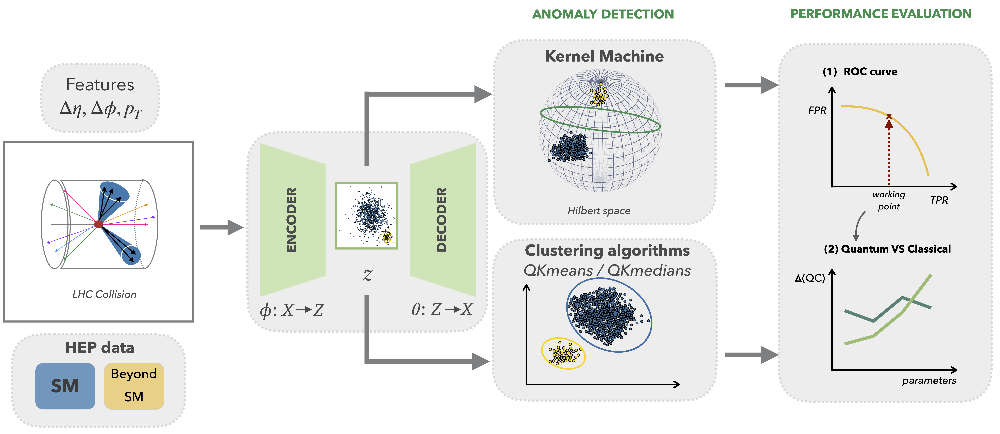

Anomaly detection with quantum machine learning for particle physics data
*************************************************************************
.. image:: https://zenodo.org/badge/494404586.svg
    :target: https://zenodo.org/badge/latestdoi/494404586
.. image:: http://img.shields.io/badge/DOI-10.48550/arXiv.2301.10780-B31B1B.svg
    :target: https://doi.org/10.48550/arXiv.2301.10780
    :alt: DOI:10.48550/arXiv.2301.10780
.. image:: https://img.shields.io/badge/email-vasileios.belis%40cern.ch-blue?style=flat-square&logo=minutemailer
    :target: mailto:vasileios.belis@cern.ch
    :alt: Email: vasilis
.. image:: https://img.shields.io/badge/CERN-QTI-lightseagreen
    :target: https://quantum.cern/our-governance
.. image:: https://img.shields.io/badge/code%20style-black-black?style=flat-square&logo=black
    :target: https://github.com/psf/black
    :alt: Code style: black
.. image:: https://img.shields.io/badge/python-3.8-blue?style=flat-square&logo=python
    :target: https://www.python.org/downloads/
    :alt: Python: version
.. image:: https://img.shields.io/badge/license-MIT-purple?style=flat-square
    :target: https://github.com/QML-HEP/ae_qml/blob/main/LICENSE
    :alt: License: version
    
This repository has the code we developed for the paper **Quantum anomaly detection in the latent space of proton collision events at the LHC** `[1] <https://arxiv.org/abs/2301.10780>`_. In this work, we investigate unsupervised quantum machine learning algorithms for anomaly detection tasks in particle physics data. 

The ``qad`` package associated with this work was created for reproducibility of the results and ease-of-use in future studies.

The figure above, taken from `[1] <https://arxiv.org/abs/2301.10780>`_, depicts the quantum\-classical pipeline for detecting (anomalous) new-physics events in proton collisions at the LHC. Our strategy, implemented in ``qad``, combines a data compression scheme with unsupervised quantum machine learning models to assist in scientific discovery at high energy physics experiments.

Citation
========

Please cite our work if you found it useful in your own research.

.. code-block:: bash

    @article{wozniak_belis_puljak2023,
    doi = {10.48550/ARXIV.2301.10780},
    url = {https://arxiv.org/abs/2301.10780},
    author = {Woźniak, Kinga Anna and Belis, Vasilis and Puljak, Ema and Barkoutsos, Panagiotis and Dissertori, Günther and Grossi, Michele and Pierini, Maurizio and Reiter, Florentin and Tavernelli, Ivano and Vallecorsa, Sofia},
    keywords = {Quantum Physics (quant-ph), Machine Learning (cs.LG), High Energy Physics - Experiment (hep-ex), FOS: Physical sciences, FOS: Physical sciences, FOS: Computer and information sciences, FOS: Computer and information sciences},
    title = {Quantum anomaly detection in the latent space of proton collision events at the LHC},
    publisher = {arXiv},
    year = {2023},
    copyright = {Creative Commons Attribution 4.0 International}
    }

How to install
==============
The package can be installed with Python's ``pip`` package manager. We recommend installing the dependencies and the package within a dedicated environment. 
You can directly install ``qad`` by running:

.. code-block:: bash

    pip install https://github.com/vbelis/latent-ad-qml/archive/main.zip

or by first cloning the repo locally and then installing the package:

.. code-block:: bash

    #!/bin/bash
    git clone https://github.com/vbelis/latent-ad-qml.git
    cd latent-ad-qml
    pip install .
The installation is expected to take a couple of minutes.

Usage
=====
Examples on how to run the code and use ``qad`` to reproduce results and plots 
from the paper can be found in the :doc:`usage <usage>` page or in the github
`repo <https://github.com/vbelis/latent-ad-qml/tree/main/scripts>`_.

References
==========
.. role:: raw-html(raw)
    :format: html

**[1]** K. A. Woźniak\*, V. Belis\*, E. Puljak\*, P. Barkoutsos, G. Dissertori, M. Grossi, M. Pierini, F. Reiter, I. Tavernelli, S. Vallecorsa , *Quantum anomaly detection in the latent space of proton collision events at the LHC*, `arXiv:2301.10780 <https://arxiv.org/abs/2301.10780>`_. :raw-html:` `
\* equal contribution

Contents
========
.. toctree::
   :maxdepth: 2
   :caption: Dimensionality Reduction

   autoencoder

.. toctree::
   :maxdepth: 2
   :caption: Algorithms

   kernel_machines
   kmedians
   kmeans

.. toctree::
   :maxdepth: 2
   :caption: Usage

   usage
